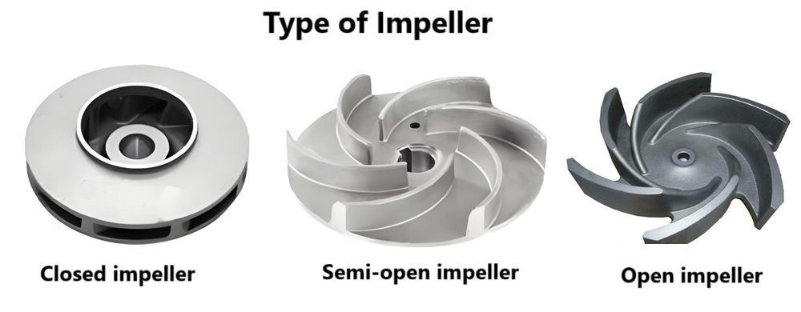

# Projects

## Single-Axis Linear Actuator & Trajectory Control System
**Timeline:** Aug 2025 - Dec 2025 | **Team Size:** 3 Members | **Links:** **[GitHub Repository](https://github.com/jullienthur/1ALA-TCS)**

**Core Technologies:** MATLAB Image Processing, Arduino C, Inverse Kinematics, Serial Communication, State Machines

 View Project Details 

### The Problem
The objective was to develop an automated control system to operate a solenoid-actuated cannon mounted on a single-axis linear rail. The system needed to autonomously track, target, fire at six pre-specified locations, and reload between each shot. The primary engineering challenge was to minimize the total operational cycle time against a baseline goal of 100 seconds, requiring seamless coordination between high-level visual data processing and low-level mechanical execution.

### The Solution
To achieve a high-speed, autonomous cycle, we built a bi-directional serial communication pipeline bridging MATLAB and an Arduino-based kinematics engine:

+ **Vision & Target Acquisition:** Implemented MATLAB image processing utilizing a color-filter array and a simplified environmental map to identify and extract the spatial coordinates of visual targets.

+ **Hardware Execution:** Passed spatial data to the Arduino C++ kinematics engine, which translated the coordinates into precise linear movements and ballistic trajectories. 

+ **Pathfinding Optimization:** Engineered a dynamic sorting algorithm that optimized the engagement sequence based on each target's spatial proximity to the fixed reloading station, drastically reducing unnecessary travel distance along the rail.

+ **Concurrent Operations:** Developed custom, non-blocking state machines in C++ to run the reloading mechanism and the linear positioning motor simultaneously, effectively eliminating standard process delays and idle time.

### The Results
Through rigorous software optimization and synchronized hardware control, the system successfully executed the complete targeting, firing, and reloading sequence with high reliability. The combination of concurrent execution and optimized pathfinding reduced the total run time from the 100-second baseline down to just 45 seconds—a **55% improvement** in overall system speed.

### Future Scope
While highly efficient, the current iteration relies on a "stop-and-shoot" mechanism, halting the cannon at an optimal point on the rail before firing. A future iteration would implement a dynamic firing system. By utilizing advanced kinematics to calculate vectors on the fly, the system could shoot *while* in motion, leveraging the actuator's lateral momentum to curve the ball's trajectory and further slash cycle times.

## Submersible Water Pump
**Timeline:** Jan 2026 - Apr 2026 | **Team Size:** 3 Members

**Core Technologies:** SolidWorks, 3D Printing (PLA), GD&T

 View Project Details 

### The Problem
For low-flow applications, standard water pumps often risk exposing internal electronics to fluid damage or suffer from internal pressure leakage. The objective of this project was to engineer a custom semi-submersible water pump that guaranteed complete electronic isolation from the fluid. Conceived as a practical exercise in Geometric Dimensioning and Tolerancing (GD&T), the system needed to overcome inherent mechanical challenges—such as excessive friction and motor startup wear—while meeting a baseline flow rate of 1 Gallon Per Minute (GPM).

### The Solution
To ensure reliable, isolated fluid transfer, we engineered a customized mechanical and hydrodynamic system using SolidWorks and PLA 3D printing:

+ **Optimized Hydrodynamics:** Modeled a custom enclosed centrifugal impeller. The backward-curved blades increase endurance in static pressure environments and reduce motor wear upon startup. Additionally, the shrouds compensate for axial movement to mitigate pressure leakage within the housing.

+ **Robust Volute Housing:** Developed a two-part standard spiral volute capable of pulling water up a 1-meter head. The bottom casing was extended around the impeller to accommodate potential shifting during sub-optimal working conditions.

+ **Mechanical Stabilization:** We encountered a critical issue with driveshaft whip, which caused excessive friction between the housing and the impeller. We solved this by designing and integrating two stabilizing brackets between the gearbox and the submerged pump section, ensuring rigid, true rotation.

+ **Power Delivery:** Integrated a 3W motor running through a 1:7.72 gearbox, achieving a stable final average output of 72 RPM under load.

### The Results
Through strategic GD&T application and multiple physical iterations, the final prototype successfully achieved complete electronic isolation. By eliminating the driveshaft whip and optimizing the impeller geometry, we increased the flow rate from the initial 1 GPM baseline to **2.5 GPM**—a 150% improvement in fluid output.

### Future Scope
While the current design meets all performance criteria, future iterations will focus on the exterior form factor and fluid path refinement. Planned improvements include an ergonomic redesign of the external housing, fine-tuning the internal volute geometry, and implementing a streamlined adapter between the end volute and the outlet pipe.

<figure>
    
    <figcaption>Figure 1: Different Impeller Designs reference</figcaption>
</figure>
<figure>
    
 <model-viewer src="assets/impeller-preview.glb" loading="lazy" alt="Interactive 3D Model of the Pump Assembly" auto-rotate camera-controls shadow-intensity="1" exposure="1.0"></model-viewer> 

    <figcaption>Figure 2: Our Final Impeller Design</figcaption>
</figure>
<figure>
    
 <model-viewer src="assets/top-case-preview.glb" loading="lazy" alt="Interactive 3D Model of the Pump Assembly" auto-rotate camera-controls shadow-intensity="1" exposure="1.0"></model-viewer> 

    <figcaption>Figure 3: Top Casing Design</figcaption>
</figure>
<figure>
    
 <model-viewer src="assets/bottom-case-preview.glb" loading="lazy" alt="Interactive 3D Model of the Pump Assembly" auto-rotate camera-controls shadow-intensity="1" exposure="1.0"></model-viewer> 

    <figcaption>Figure 4: Bottom Casing Design</figcaption>
</figure>    

## My Portfolio Site!
**Timeline:** Mar 2026 - May 2026 | **Links:** **[GitHub Repository](https://github.com/jullienthur/jullienthur.github.io)**

**Core Technologies:** HTML/CSS, JavaScript, Jekyll, Git/GitHub

 View Project Details 

### The Problem
I required a centralized, professional platform to showcase my engineering portfolio, technical write-ups, and personal projects. Relying strictly on raw GitHub repositories lacked the visual presentation and user experience necessary for a professional portfolio. The objective was to engineer a lightweight, easily maintainable, and visually appealing static website to host these detailed write-ups.

### The Solution
I designed and deployed a custom static website, leveraging GitHub Pages for its robust hosting infrastructure and seamless continuous integration capabilities:

+ **Site Architecture:** Implemented Jekyll, a static site generator, to seamlessly convert Markdown files into structured HTML. This architecture allows for rapid content updates and drastically simplifies long-term maintenance.

+ **Deployment Pipeline:** Utilized Git push/fetch workflows to establish a streamlined, rapid deployment pipeline, allowing for immediate live-site iterations.

+ **Interactive UI/UX:** Integrated custom HTML, CSS, and JavaScript to engineer a feature-rich, user-friendly interface. This process included exploring advanced feature integration, resulting in a few interactive "easter eggs" hidden throughout the site. and the submerged pump section, ensuring rigid, true rotation.

### The Results
Successfully launched a fully responsive and easily maintainable portfolio site (the one you are currently browsing!). By adopting a Jekyll-based architecture and automated GitHub Pages deployment, the friction of documenting and publishing new technical projects has been practically eliminated.

### Future Scope
Future iterations will expand the site's scope beyond my academic and professional engineering efforts. I plan to integrate dedicated sections for personal projects, including reflections on outside literature and documentation of what I've learned from several years of gardening.

## Long Short-Term Memory (LSTM) Recurrent Neural Network (RNN)
**Timeline:** July 2026 - Present

**Core Technologies:** TBD

 View Project Details 

This page is still under construction! Please return later for a deep-dive into this project!

